# Captura d'imatges 

## Client Ubuntu

Per fer una captura necessitem entrar a l'apartat: 

`Images>Create New Image`

I emplenem les dades de la nova imatges, de forma que correspongui amb el client, li donem un nom, el sistema operatiu, el tipus d'imatge i si volem usar compressió (aquest ultim pot ser util en un espai de disc reduït i cpu potent), i l'aplicarém amb el botò `Add`.

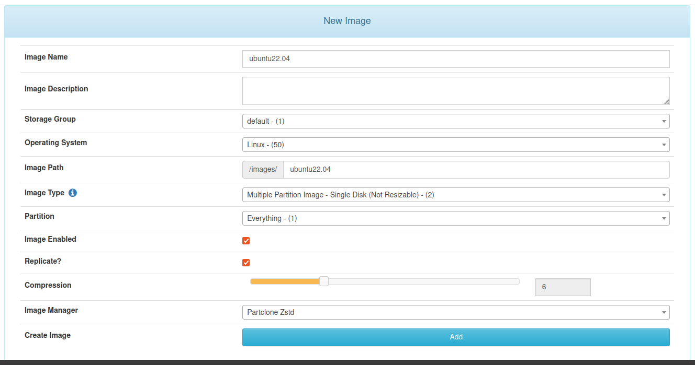

 

Després a la configuració del client aplicarém la `Host Image` a la nova configurada.

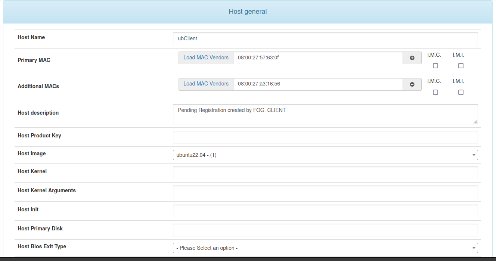

 

Amb el client sel·leccionat, entrarém a l'apartat `Basic Tasks`, i en l'opció `Capture`:

 

En aquesta finestra podem deixar les opcións perdefecte, i llençar la tasca amb el botó `Task`:

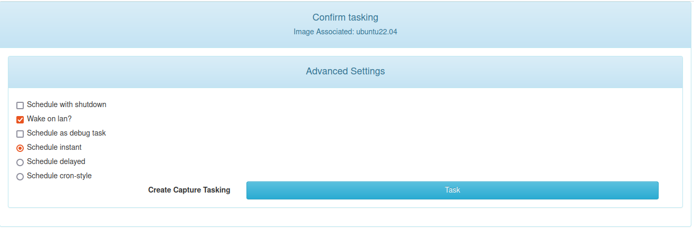

 

I cal que apaguem i engeguem el client, si ho hem fet tot correcte ens hauria de sortir la següent pantalla al inicar-se la màquina:

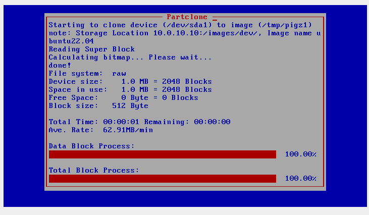

 

En el servidór, a l'apartat de tasques podrém veure el progrés de la captura:

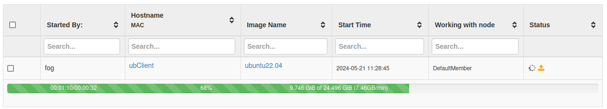

 

Una vegada acabada la captura la veurém a l'apartat d'imatges. (Nota, l'apartat de `Image Size: ON CLIENT` en aquest cas és l'espai que té el disc de boot del client, no l'espai que ocupa l'imatge ja capturada)

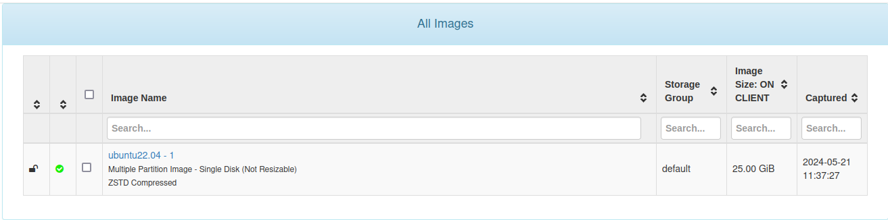

 

Aqui podem veure que l'imatge ja capturada en el servidor ocupa approximadament 4,1GB:

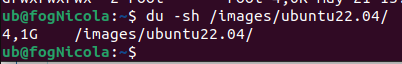

## Client Windows

Una captura en windows és igual a la d'ubuntu, primer de tot crearém una nova imatge:

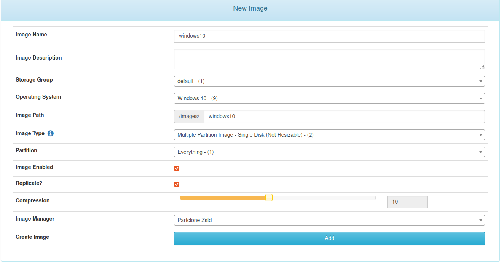

 

Després l'assignem a un client ja registrat:

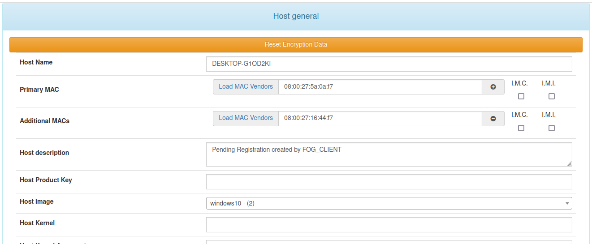

 

Executem la tasca de captura:

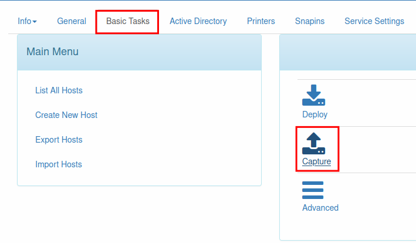

 

I una vegada apaguem i torném a encendre el client podem veure que la captura es realitza correctament:

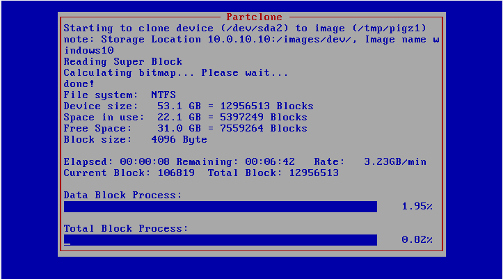

 

Aqui podem veure el resultat d'ambdues captures:

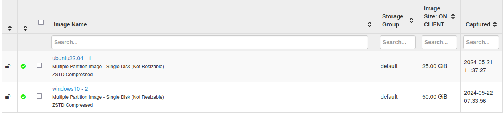

### Resolució de problemes 

- En cas que la màquina client s'ens quedi en un boot loop després de crear la tasca de captura, cal que ens assegurem de tenir l'interfície `NAT` deshabilitada, que no desconectada.
- Cal que el boot order tingui l'opció d'inici en xarxa habilitat i el primer de la llista.
- També pot donar problemes que reiniciem la màquina amés d'apagar-la i engegar-la