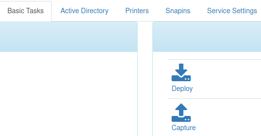
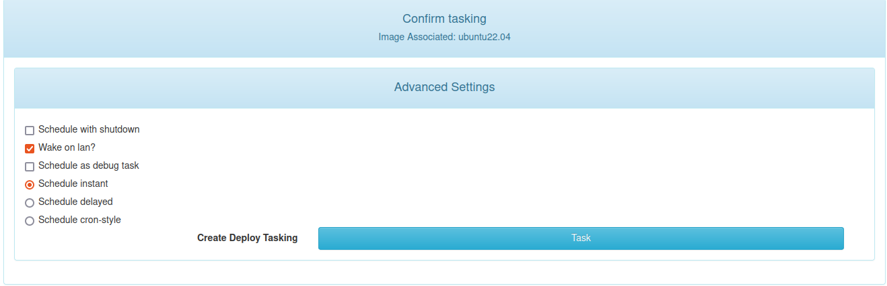
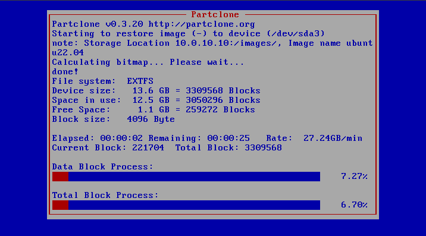
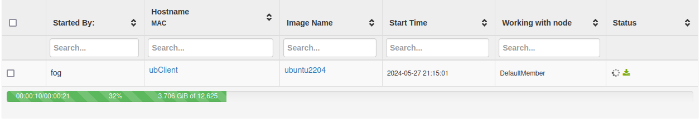
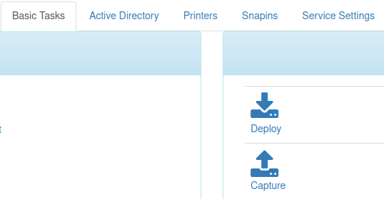
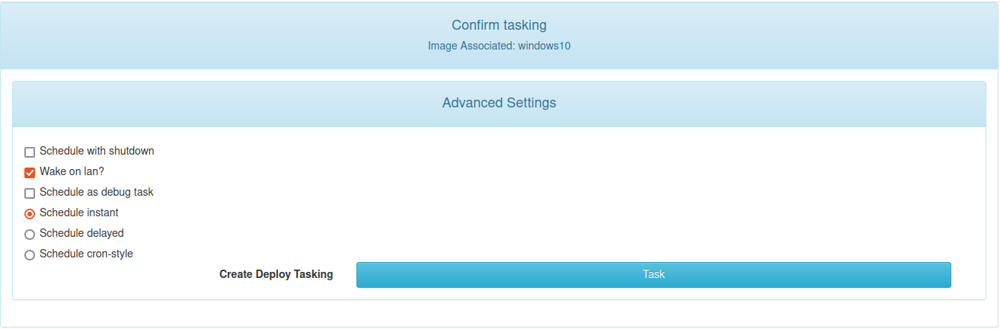
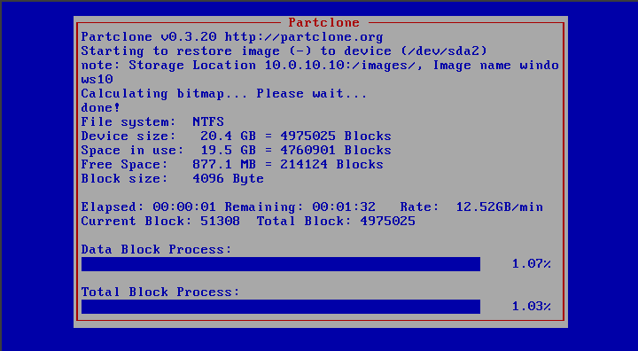
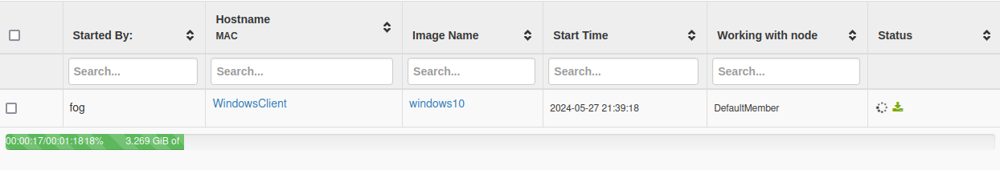

# Deploy d'imatges

## Deploy d'una imatge Ubuntu

Primer de tot necessitem sel·leccionar quina imatge volem fer el deploy  al client:

 

Dintre de `Basic Tasks` utilitzarém `Deploy`:

 

Confirmém l'acció i el moment en quant la programem:

 

Reiniciem el client, i iniciem per lan, podem veure que s'està aplicant l'imatge:

 

Aquesta es la vista des de la web ui del servidor:

## Deploy d'una imatge Windows

Primer de tot necessitem sel·leccionar quina imatge volem fer el deploy  al client:

 

Dintre de `Basic Tasks` utilitzarém `Deploy`:

 

Confirmém l'acció i el moment en quant la programem:

 

Reiniciem el client, i iniciem per lan, podem veure que s'està aplicant l'imatge:

 

Aquesta es la vista des de la web ui del servidor:

