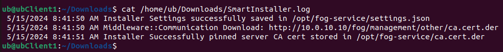
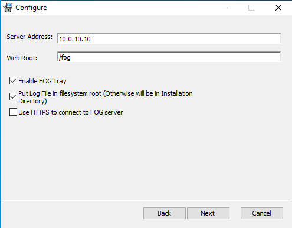
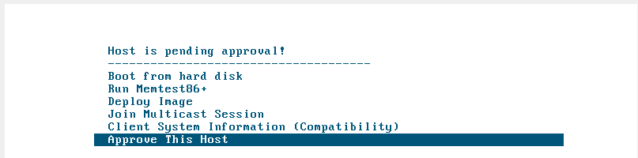
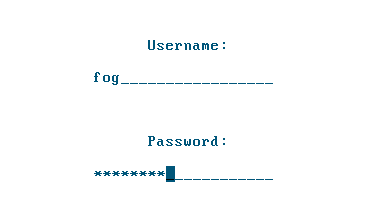
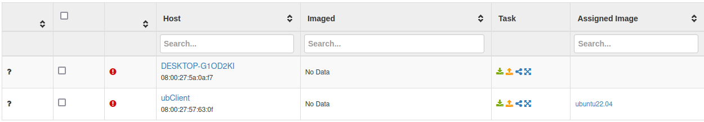

# Instalació i configuració d'un client

## Instal·lació en un client Ubuntu 22.04

Com el servidor fog només té paquets d'instal·lació .exe, primer necessitarém una capa de compatibilitat que es diu [mono](https://www.mono-project.com/):

 

Després descarregarem el paquet `SmartInstaller.exe` del servidor:

 

Iniciarém l'instal·lació del client amb `sudo mono SmartInstaller.exe`.

 

Configurem IP del servidor, l'adreça del webroot, podem habilitar si volem una icona a la tray, i si volem auto-iniciar:

 

Després farém un cat del .log resultant, i comprobém que s'hagi instal·lat correctament

## Instal·lació en un client Windows 10 

Per instal·lar el client de windows no necessitem paquets adicionals, podem descarregar el `Smart Installer` i instal·lar-lo directament.

 

En el procés d'instal·lació necessitem indicar l'adreça del servidor, les demés opcións les podem deixar per defecte

 

Després necessitem reiniciar la màquina, i iniciar el sistema per xarxa, ens sortirà el menú PXE del fog, necessitem l'opció `Aoorive This Host`:

 

Introduïrem les credencials:

 

I ens ha de dire que s'ha aprovat correctament:

 

Una vegada fet tot aixó podrém tornar a la WebUI i veurém un nou equip registrat:

