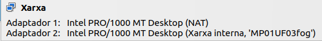
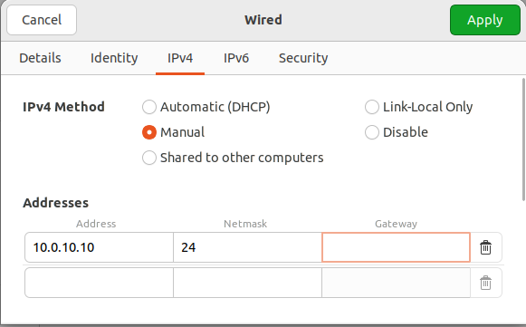
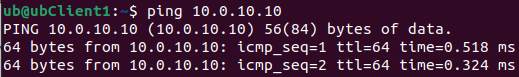

# Passos prèvis a la pràctica

[Home](index.md)

## Configuració de virtualbox

En les màquines virtuals, tant clients com servidors tindrém dos adaptadors de xarxa, una NAT, que farém servir per tenir internet a les màquines, i una xarxa interna per fer la pràctica.

Al servidor configurém una ip estàtica `10.10.10.10`

I comprovo que des-del client podem fer PING al servidor

