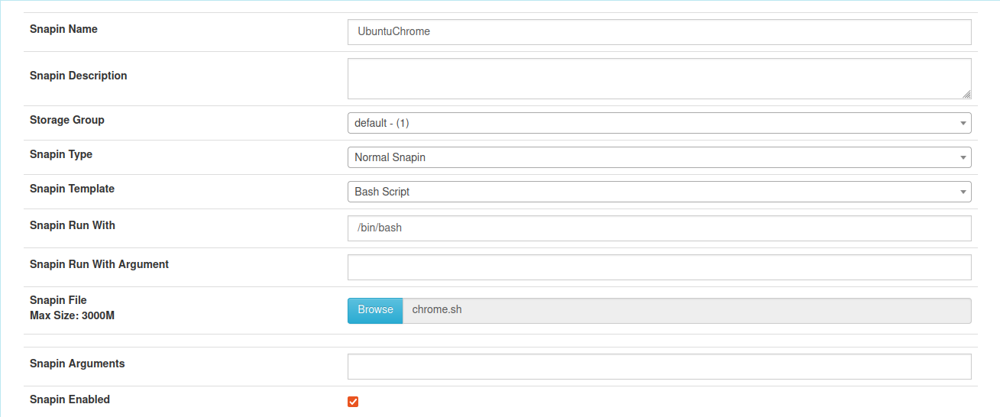
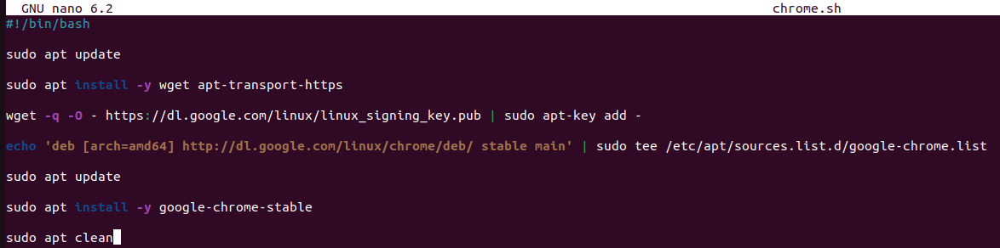
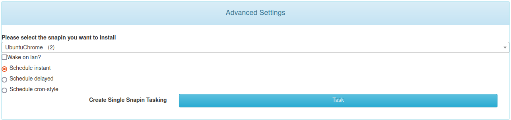
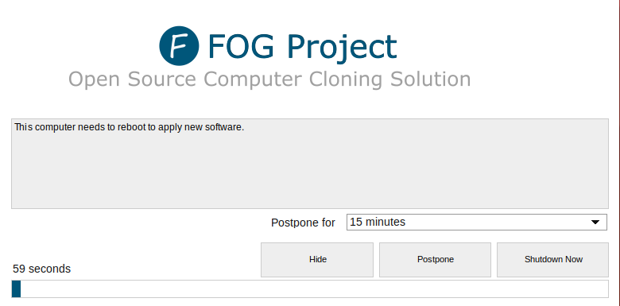
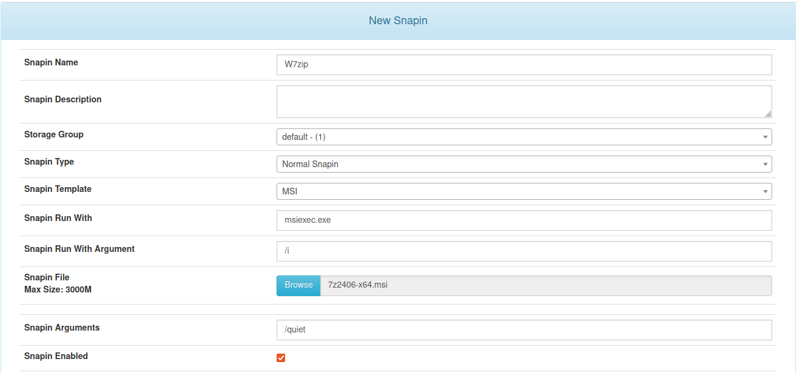
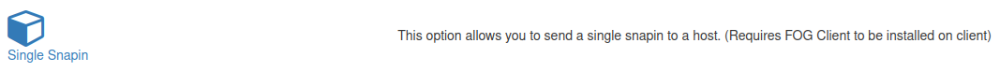
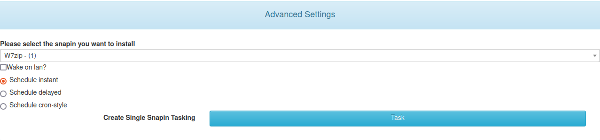
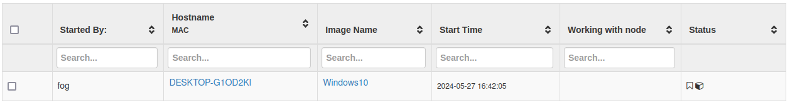

# Captura d'imatges 

## Client Ubuntu

Primer de tot crearém un nou snapin, amb el nom, tipus de snapin, la template i el file:

 

Aquest és l'script que correrém:

 

Una vegada penjat i guardat, dintre de basic tasks del client, sel·leccionarém l'apartat de `Advanced Options > Single Snapin`:

 

Després sel·leccionem la tasca a executar i el moment:

 

En el client, una vegada s'acabi d'executar el snapin veurém aquest pop-up demanant-nos si volem reiniciar ara el client:

## Client Windows

Primer de tot crearém un nou snapin, amb el nom, tipus de snapin, la template i el file:

 

Una vegada penjat i guardat, dintre de basic tasks del client, sel·leccionarém l'apartat de `Advanced Options > Single Snapin`:

 

Després sel·leccionem la tasca a executar i el moment:

 

En el client, una vegada s'acabi d'executar el snapin veurém aquest pop-up demanant-nos si volem reiniciar ara el client:

