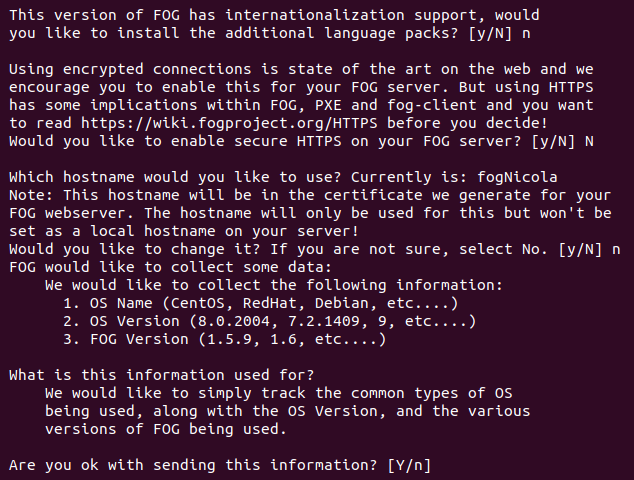
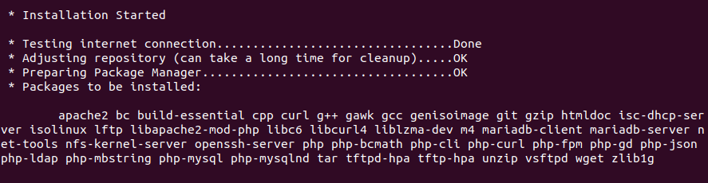
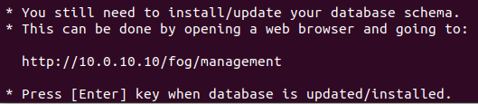
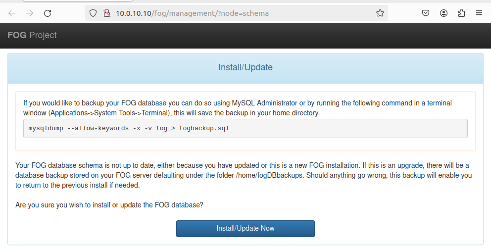

# Instalació i configuració del servidor FOG

Per instal·lar el servidor entrarém amb usuari root, i utilitzarém git per clonar el repositori de fogproject:

 

Iniciem l'instalació amb l'script `bin/installfog.sh`. Iniciarém l'instal·lació indicant que utilitzem un servidor basat en debian:

 

Com aquest serà l'unic servidor que instal·larém el configurem com un servidor `Normal`:

 

Sel·leccionarém l'interfície `enp0s8` per donar el servei:

 

Necessitem un servidor DHCP, deixarém que el propi servidor s'encarregui de donar DHCP

 

Ens demana si volem instal·lar traducció, ssl, si volem cambiar el hostname del servidor i si volem compartir informació amb el FogProject:

 

Confirmem que l'informació sigui correcta avans de començar l'instal·lació:

 

Comença l'instal·lació:

 

Necessitem configurar la base de dades, ho farém entrant a l'ip del servidor, `x.x.x.x/fog/management`:

 

Com aquesta és una instal·lació des-de net, ens saltarém fer un backup de la BD existent:

 

I aquesta és l'interfície de Management del servidor una vegada acabada l'instal·lació:

